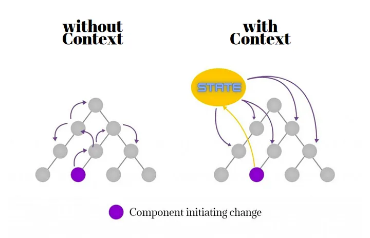

# useContext Hook

`useContext` is a React Hook that lets you read and subscribe to [`context`](https://react.dev/learn/passing-data-deeply-with-context) from your component. [`For more info`](https://react.dev/reference/react/useContext)

```jsx
import { useContext } from 'react';

function MyComponent() {
  const theme = useContext(ThemeContext);
  // ...
```



## Parameters

- `SomeContext`: The context that you’ve previously created with `createContext`. The context itself does not hold the information, it only represents the kind of information you can provide or read from components.

## Returns

useContext returns the context value for the calling component.

## Syntax

```jsx
import React, { createContext, useContext } from "react";

// Step 1: Create a context
const ThemeContext = createContext("light");

// Step 2: Provide a context value
function App() {
  return (
    <ThemeContext.Provider value="dark">
      <Toolbar />
    </ThemeContext.Provider>
  );
}

// Step 3: Consume the context value
function Toolbar() {
  const theme = useContext(ThemeContext);
  return (
    <div>
      <p>Current Theme: {theme}</p>
    </div>
  );
}

export default App;
```
