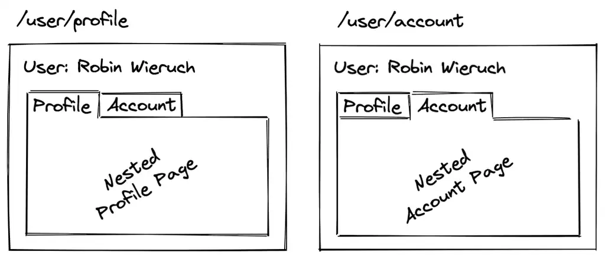

# Nested Routes

Nested routes in React Router involve organizing routes within other routes, creating a hierarchical structure for rendering components based on URL segments.



## Example

```jsx
import { BrowserRouter as Router, Route, Switch } from "react-router-dom";

const App = () => {
  return (
    <Router>
      <Switch>
        <Route exact path="/" component={Home} />
        <Route path="/about" component={About} />
        <Route path="/contact" component={Contact} />
        <Route path="/products" component={Products}>
          <Route path="electronics" component={Electronics} />
        </Route>
      </Switch>
    </Router>
  );
};
```

```jsx
import { Outlet } from "react-router-dom";

function Products() {
  return (
    <Container>
      <Items />
      <Outlet /> //If the app's location matches the nested Route's path, this Outlet
      component will render the Route's element.
    </Container>
  );
}
```
