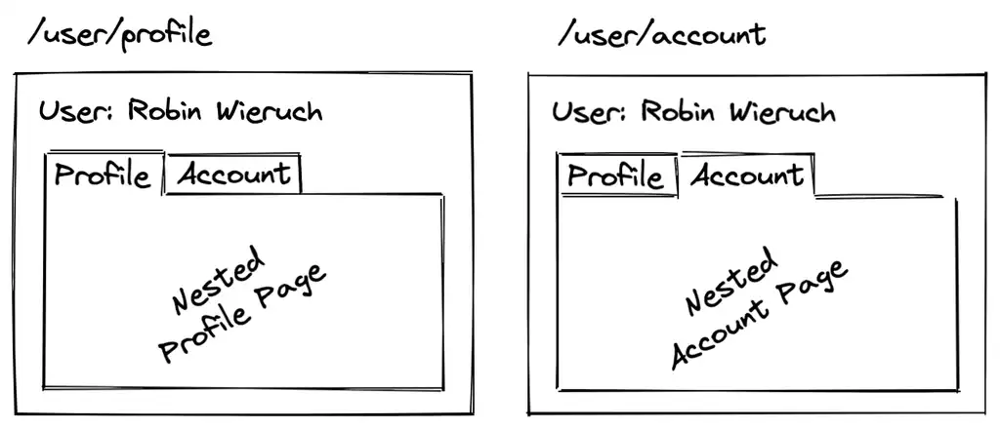

# Nested Routes

- The code illustrates nested routes in a React application with React Router.
  
- Components for home, about, contact, and products pages are defined.
- Nested routes are configured for product categories like electronics and clothing.
- Navigation menu enables easy movement between app sections.
- Enhanced code organization simplifies management of routing complexities.
