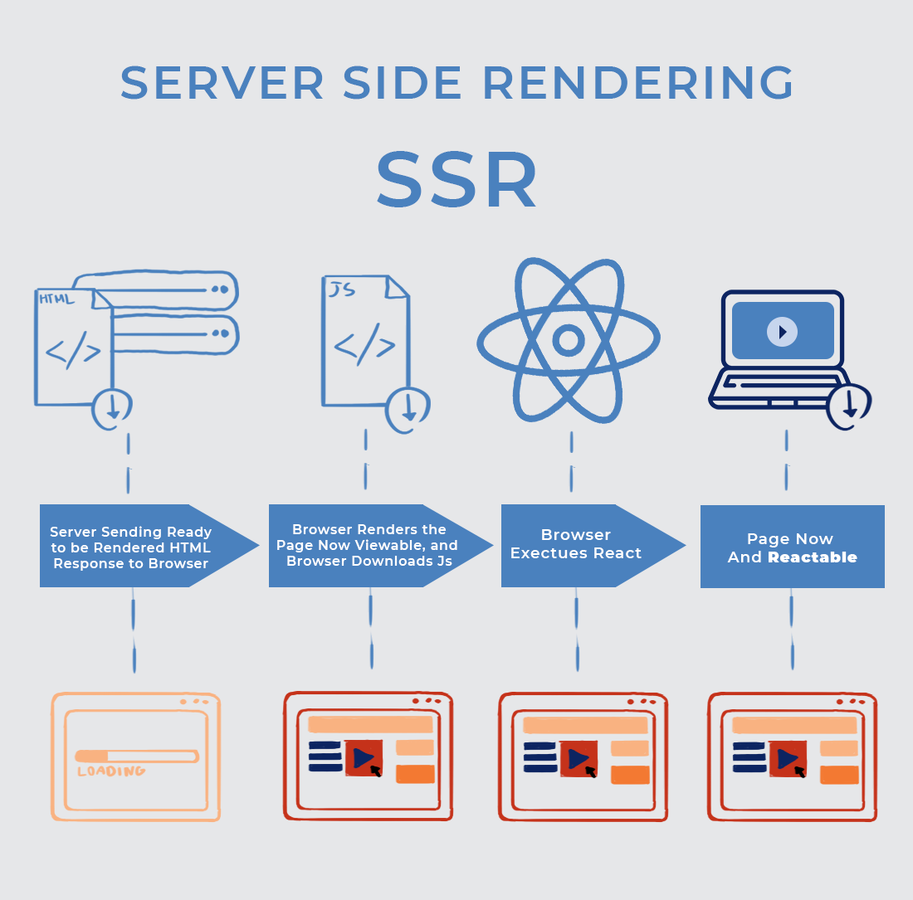

# Server-Side Rendering (SSR)

Server-side rendering refers to an application’s ability to display the web-page on the server rather than rendering it in the browser.

When a website’s JavaScript is rendered on the website’s server, a fully rendered page is sent to the client and the client’s JavaScript bundle engages and enables the Single Page Application framework to operate.

