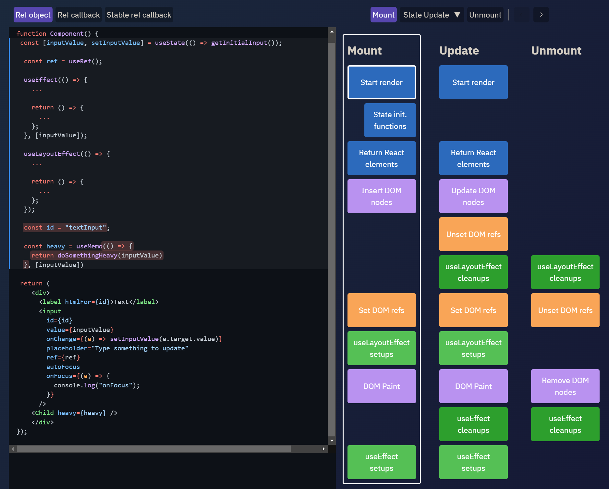

# What is "Rendering"?

**Rendering** is the process of React asking your components to describe what they want their section of the UI to look like, now, based on the current combination of props and state.

Sure, here's a Markdown version of the rendering process overview:

## Rendering Process Overview

During the rendering process, React follows these steps:

1. **Traversal of Component Tree**: React starts at the root of the component tree and loops downwards to find all components needing updates.

2. **Render Function Invocation**: For each flagged component, React calls either `FunctionComponent(props)` for function components or `classComponentInstance.render()` for class components, generating render output in JSX syntax.

3. **JSX to React.createElement() Conversion**: JSX syntax is converted to `React.createElement()` calls as JavaScript is compiled, resulting in React elements, plain JS objects describing the UI structure.

   Example:

   ```jsx
   // JSX syntax
   return <MyComponent a={42} b="testing">Text here</MyComponent>

   // Converted call
   return React.createElement(MyComponent, {a: 42, b: "testing"}, "Text Here")

   // Resulting element object
   {type: MyComponent, props: {a: 42, b: "testing"}, children: ["Text Here"]}
   ```

4. **Rendering of Components**: React invokes the function or method to render the component, passing props and children.

5. **Reconciliation (Diffing)**: React compares the new "virtual DOM" tree with the previous one to determine differences.

6. **Calculation of Changes**: React computes a list of changes required to make the real DOM match the current output.

7. **Application of Changes**: React applies all changes to the DOM in one synchronous sequence.

This process efficiently updates the UI in response to state changes, ensuring a smooth user experience.

## Render and Commit Phases in React

The React update process involves two key phases:

### Render Phase

- Renders components and calculates changes in the virtual DOM.
- May not result in visible DOM changes if the output remains the same.
- Concurrent Rendering allows for multiple render passes, prioritizing browser events.

### Commit Phase

- Applies changes to the actual DOM after the render phase.
- Adjusts refs, executes lifecycle methods, and handles effects.
- Ensures synchronous and consistent DOM updates.

### Concurrent Rendering (React 18)

- Introduces features like `useTransition` for efficient event handling.
- React manages rendering interruptions for UI consistency.



Certainly:

## Standard Render Behavior

React's default behavior is to recursively render all child components when a parent component renders.

For instance:

- In a component tree A > B > C > D, if a button in B triggers a setState() in B:
  - React starts rendering from the top.
  - A is skipped if it doesn't need an update.
  - B is updated and renders, returning `<C />`.
  - Even if C didn't need an update, it's rendered due to its parent B's update.
  - Similarly, D is rendered because of C's update.

In summary:

- Rendering a component leads to the rendering of all child components by default.
- React doesn't consider prop changes during normal rendering; it renders child components regardless.
- Calling setState() in the root `<App>` component may trigger a re-render of the entire component tree.
- Rendering is crucial for React to determine if DOM changes are necessary.
