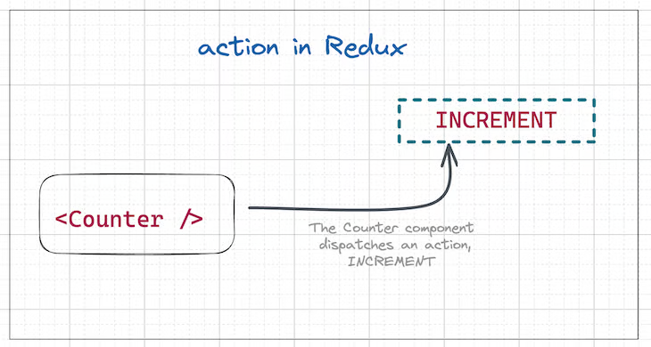
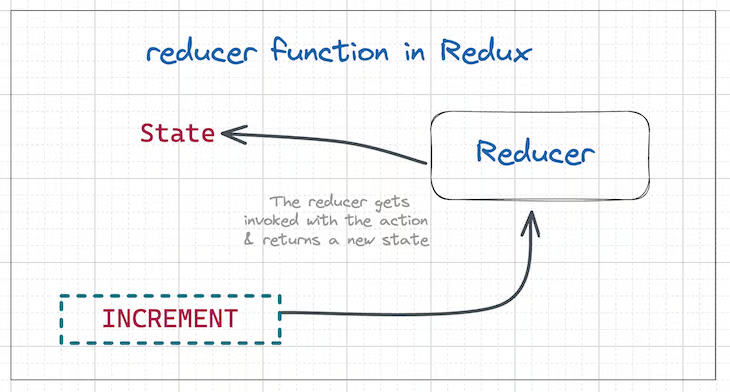
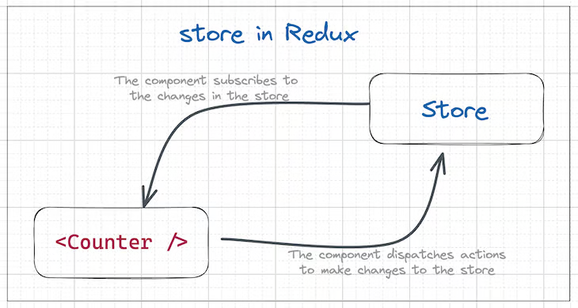

# How Redux works

The way Redux works is simple. There is a central store that holds the entire state of the application. Each component can access the stored state without having to send down props from one component to another.

There are three core components in Redux — **actions**, **store**, and **reducers**.

## Redux actions

Redux actions serve as events, representing the sole means of transmitting data from your application to the Redux store. This data may originate from user interactions, API calls, or form submissions.

Actions are plain JavaScript objects with two required properties:

- `type`: Specifies the action's type.
- `payload`: Contains the data to modify the state.

Actions are executed via the `dispatch()` method, which forwards the action to the store:

## Redux reducers

Reducers are **pure functions** that take the current state of an application, perform an action, and return a new state. The reducer handles how the state (application data) will change in response to an action:

## Redux store

The Redux store is a container for the application state, where state changes are driven by dispatched actions. It's recommended to maintain a single store. Components connect to the store, updating it through actions and subscribing to changes for re-rendering:

