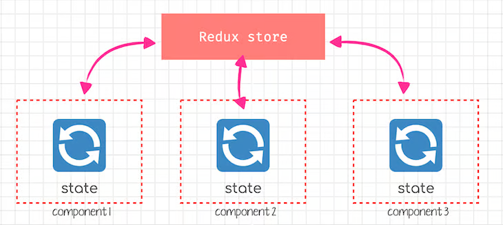

# What is redux

Redux is a predictable state container for JavaScript apps.

Redux allows you to manage your app’s state in a single place and keep changes in your app more predictable and traceable, making it easier to understand the changes happening in your app.
But all of these benefits come with a set of **challenges**.

## What is Redux used for ?

Redux maintains and updates shared data across components in a large application, keeping them independent by centralizing the state in a Redux store.

For passing data from a parent to a deeply nested child in React, Context can be used. However, for sharing state between components on the same level, Redux is the preferred choice.

## Redux with React

Redux is a standalone library that can be used with different JavaScript frameworks including Angular, Inferno, Vue, Preact, React, etc. However, Redux is most frequently used with [**React**](../../React).

React enforces **one-way** data flow: from parent to child. In Redux, state changes are orchestrated through actions, maintaining a clear distinction between modifying and observing state.

## State management with Redux

State management organizes data sharing across components. While React and Angular handle internal state management for individual components, this becomes cumbersome in larger apps.

Determining state location is tricky, especially for sharing among components. In React, for example, sibling components typically share state stored in their parent component, with updates passed down as props.
